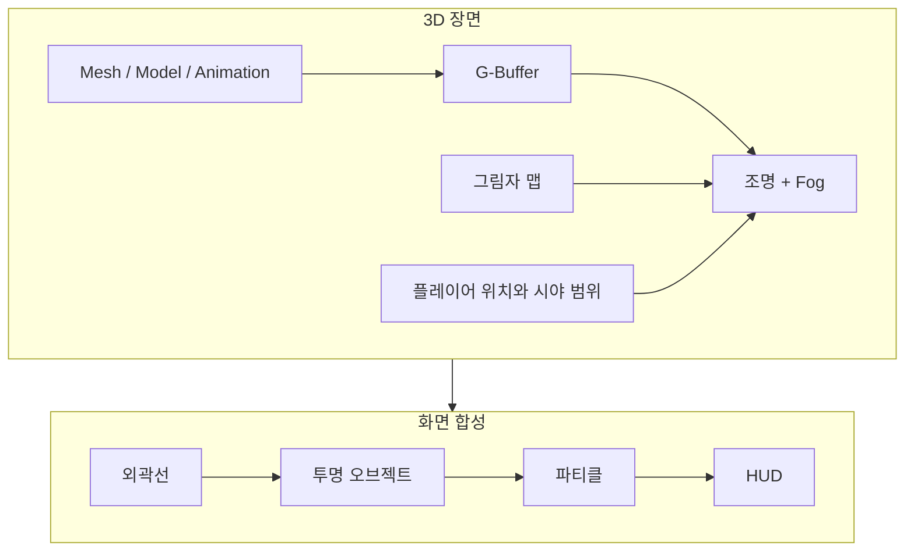
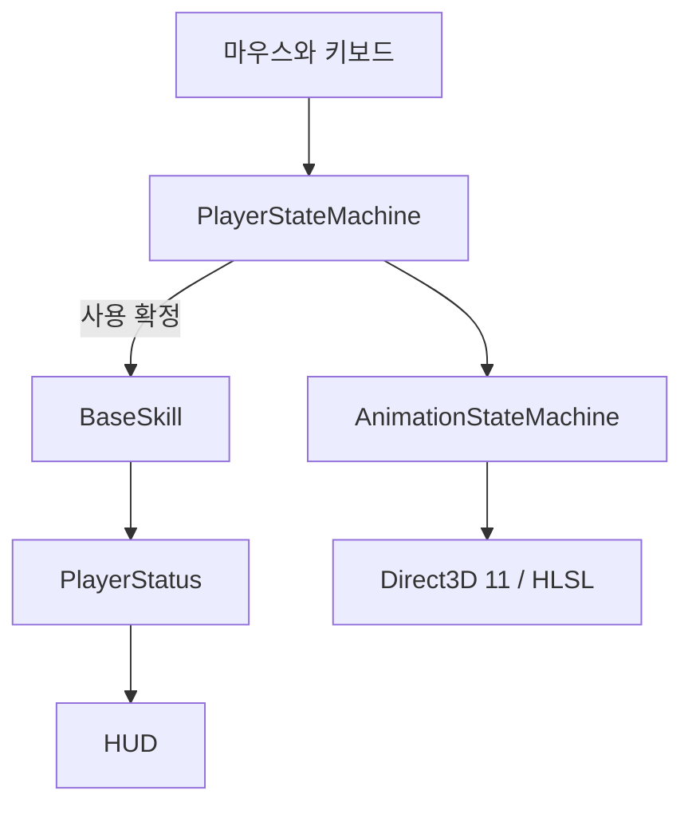
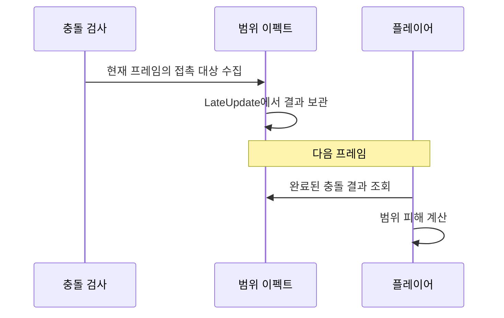

# Survival Arena

C++ / DirectX 11 기반의 탑다운 생존 게임입니다.

## 주요 기능

| 기능 | 구현 내용 |
| --- | --- |
| 렌더링 | 디퍼드와 포워드 혼합, 그림자 맵, Fog of War, 외곽선, 투명 효과와 파티클 |
| 리소스와 애니메이션 | 메시와 재질 로딩, 텍스처 캐시, 본 행렬 텍스처를 이용한 GPU 스키닝 |
| 전투 | 우클릭 대상 공격, Q 충전과 돌진, W 방어 후 반격, 스킬별 사용 조건과 쿨타임 |
| 몬스터와 보스 | 피격 후 추격과 공격, 거리별 상태 전환, 보스의 시간차 범위 공격 |
| 성장과 제작 | 스킬 강화, 재료 획득, 장비 제작과 착용, 능력치 반영 |
| 이동과 충돌 | 내비게이션 메시 A*, Sphere / AABB / OBB 충돌과 피킹, 쿼드트리 |
| UI와 편집 도구 | 체력과 쿨타임 HUD, 버튼과 스크롤, ImGui와 ImGuizmo, F3 충돌 영역 표시 |

## 화면을 그리는 과정

불투명 오브젝트는 G-Buffer에 색상, 법선, 위치와 재질 정보를 기록합니다. 조명 단계에서 그림자와 Fog를 합성하고, 외곽선과 투명 효과를 더한 뒤 HUD를 그립니다.



메시는 정점과 인덱스 버퍼로, 텍스처는 셰이더 리소스로 올립니다. 애니메이션은 프레임별 본 행렬을 텍스처에 저장하고, 버텍스 셰이더에서 보간해 재생합니다. 같은 리소스를 쓰는 오브젝트는 인스턴싱으로 묶습니다.

Fog는 플레이어와의 거리로 밝기를 조절합니다. 시야 경계를 부드럽게 보간하고, 멀어진 몬스터와 체력바는 숨깁니다.

몬스터는 공격받으면 공격자를 추격하고, 사거리에 따라 공격 상태로 전환합니다. 보스는 대상 방향에 원형 판정 5개를 배치한 뒤 2.25초 후 피해를 계산합니다. 여러 범위에 겹친 대상은 한 번만 타격합니다.

## 실행에서 측정한 결과

| 항목 | 확인한 결과 |
| --- | --- |
| 렌더링 부하 | 같은 소품 1,024개에서 개별 그리기 51.7 FPS, 인스턴싱 89.6 FPS. 호출 수 2,262회에서 214회로 감소 |
| A* 길찾기 | 내비게이션 삼각형 709개, 고정 경로 6개를 각각 100회 검색. 경로 유효성과 실제 이동 확인 |
| 쿼드트리 | 충돌체 1,024개의 후보 검사 523,776회에서 11,836회로 감소. 겹친 128쌍은 두 방식에서 동일 |


쿼드트리는 재사용 시 충돌 처리가 3.73ms였지만, 재구축에는 약 11.98ms가 더 들었습니다. 검사 횟수와 전체 처리 비용을 함께 확인했습니다.

1920×1080, Release, VSync 해제 조건입니다. 녹화와 성능 측정은 따로 실행했습니다. [측정 방법과 전체 결과](docs/implementation/engine-measurements.md)

## 구조

Client는 캐릭터, 스킬, 아이템과 UI를 다룹니다. Engine은 입력, 상태 전환, 충돌, 길찾기와 렌더링을 맡습니다.



| 데이터 | 보관하는 값 |
| --- | --- |
| PlayerStatus | 레벨, 체력, 스태미나, 공격력, 스킬 포인트 |
| Skill | 스킬 단계, 남은 쿨타임, 소모량, 피해 배율 |
| Item / Recipe | 아이템 ID와 등급, 재료 두 종류와 제작 결과 |

## 핵심 문제 해결

### 1. 스킬 사용과 비용 차감 시점 맞추기

입력을 받은 시점과 상태 전환을 처리하는 시점은 다릅니다. 그사이에 행동이 취소되거나 대상이 사라지면, 스킬은 나가지 않고 비용만 차감될 수 있었습니다.

<details>
<summary>분석과 수정 과정</summary>

입력 단계에서는 스킬 번호와 대상만 보관하도록 바꿨습니다. 상태 전환 직전에 현재 행동, 쿨타임, 스태미나를 다시 검사하고, 대상 지정 스킬은 대상의 생존 여부와 거리도 확인합니다. 이 검사를 통과한 뒤에만 `OnSkillUsed`를 호출합니다.

콜백을 무조건 상태 진입 뒤로 옮기지는 않았습니다. R은 상태에 진입하기 전에 돌진 시간을 설정해야 하므로, 검사를 먼저 끝내고 콜백과 상태 진입 순서를 유지했습니다. 격투가의 비용 차감은 `BaseSkill::ExecuteSkill` 한 곳에서 처리합니다.

```cpp
if (!CanExecuteSkill()) return;
if (m_progressionEnabled)
{
    m_castInProgress = true;
    m_cooldownStarted = false;
    m_playerObject->SetStamina(m_playerObject->GetStatus().stamina - GetStaminaCost());
}
PlaySkill();
```

같은 프레임의 중복 입력, 전환 직전 자원 부족, 죽거나 멀어진 대상을 검사했습니다. 거부된 입력은 비용을 쓰지 않고, 허용된 입력은 한 번만 차감합니다. 실제 플레이에서는 E와 R의 쿨타임 중 재사용이 막히는지 확인했습니다.

[상태 전환 코드](game/Engine/PlayerStateMachine.cpp) / [스킬 실행 코드](game/Client/BaseSkill.cpp) / [입력 수락 검사](tests/game_skill_admission_fixture.cpp)

</details>

### 2. 갱신 순서에 따라 빠지는 범위 공격 타격

범위 공격이 모은 충돌 대상을 `Update`에서 지우고 있었습니다. 이펙트가 플레이어보다 먼저 갱신되면, 플레이어가 피해를 계산할 때 목록이 이미 비어 있었습니다.

<details>
<summary>분석과 수정 과정</summary>

이번 충돌 검사에서 모으는 목록과 피해 계산에 사용할 목록을 나눴습니다. 충돌 검사가 끝난 `LateUpdate`에서 두 목록을 바꾸고, 다음 `Update`는 완료된 결과를 읽게 했습니다.

```cpp
m_collisionSnapshot.swap(m_object);
m_object.clear();
```



이펙트를 먼저 갱신해도 타격 대상이 유지되는지 검사했습니다. 범위를 벗어난 적이 다음 결과에서 빠지는지, 스킬 종료 후 이전 대상이 남지 않는지도 확인했습니다. 객체의 갱신 순서에 의존하지 않게 된 대신, 피해 판정은 완료된 이전 프레임의 충돌 결과를 사용합니다.

[충돌 결과 보관 코드](game/Client/BiancaESkillCircle.cpp) / [갱신 순서 검사](tests/game_skill_collision_fixture.cpp)

</details>

### 3. 충돌 후보는 줄었지만 더 느렸던 쿼드트리

충돌체 1,024개에서 후보 검사는 97.7% 줄었습니다. 하지만 트리를 새로 만드는 시간까지 합치면 전체 쌍 검사보다 오래 걸렸습니다.

<details>
<summary>분석과 수정 과정</summary>

전체 쌍 검사, 트리 구축, 트리의 충돌 처리를 따로 측정했습니다. 같은 충돌체를 두 방식으로 검사하고, 찾아낸 충돌 ID 쌍도 대조했습니다. 후보만 줄고 충돌을 놓치는 경우를 구분하기 위해서입니다.

| 측정 구간 | 시간 중앙값 |
| --- | --- |
| 전체 쌍 검사 | 9.28ms |
| 기존 트리의 충돌 처리 | 3.73ms |
| 트리 구축 | 11.98ms |
| 구축과 충돌 처리를 함께 실행 | 15.68ms |

장면의 기존 재사용 조건도 확인했습니다. 객체의 위치와 활성 상태, 개수 또는 카메라가 바뀌면 트리를 갱신하고, 바뀌지 않은 프레임에서는 기존 트리를 사용합니다. 트리를 재사용하는 조건과 매번 다시 만드는 조건을 나눠 봐야 적용 효과를 판단할 수 있었습니다.

두 방식에서 겹친 128쌍은 같았습니다. 재사용 시 충돌 처리 비용은 줄었지만, 객체와 카메라가 자주 움직이는 장면의 전체 프레임 성능까지 개선됐다고 결론 내리지는 않았습니다.

[트리 갱신 조건](game/Engine/SceneObjectManager.cpp) / [충돌 검사](game/Engine/QuadTree.cpp) / [측정 방법과 원본](docs/implementation/engine-measurements.md)

</details>

## 사용 기술

C++17, Direct3D 11, HLSL, Direct2D / DirectWrite, DirectXTex, FMOD를 사용합니다. 편집 도구는 ImGui / ImGuizmo, 별도 모델 변환 도구는 Assimp 기반입니다. 빌드는 CMake와 MSBuild, 실행 및 검증 스크립트는 PowerShell과 Python으로 구성했습니다.

<details>
<summary>프로젝트 폴더</summary>

```text
game/
├── Client/          캐릭터, 스킬, 몬스터, 아이템과 HUD
├── Engine/          렌더링, 컴포넌트, 상태 전환, 충돌과 길찾기
└── Shaders/         G-Buffer, 조명, Fog, 외곽선과 이펙트
apps/asset_tool/     Assimp 모델 변환, DDS 텍스처 변환
scripts/            빌드, 실행, 검사와 측정
tests/              동작 검사
docs/               측정 방법과 원본 데이터
```

</details>

## 실행

Windows x64, Visual Studio 2022 C++ 도구가 필요합니다. SDK와 게임 리소스는 로컬 패키지로 별도 준비합니다.

```powershell
./scripts/bootstrap.ps1 -Preset windows-game-release `
  -SdkRoot 'C:/local-package/sdk-release' -AssetRoot 'C:/local-package/assets'
./scripts/build.ps1 -Preset windows-game-release
./scripts/test.ps1 -Preset windows-game-release
./scripts/run_game.ps1 -Executable './out/build/game-msvc-release/game/Release/runtime/Binaries/dxa_game.exe'
```

Release에서도 파일 읽기와 D3D 객체 생성이 실행되도록 `assert` 내부 호출을 분리했습니다. 파일 I/O는 [NDEBUG 검사](tests/game_file_io_fixture.cpp)로 확인합니다.

## 저작권 및 라이선스

학습 및 포트폴리오 목적으로 제작한 비공식 클론코딩 프로젝트입니다. 이터널 리턴 리소스의 저작권은 ㈜님블뉴런 및 각 권리자에게 있습니다. 해당 원본 에셋과 실행 패키지는 배포하지 않으며, 수익화를 하지 않습니다.

[외부 리소스와 라이선스](THIRD_PARTY_ASSETS.md) / [님블뉴런 IP 이용 정책](https://support.playeternalreturn.com/hc/ko/articles/49503976113177)
