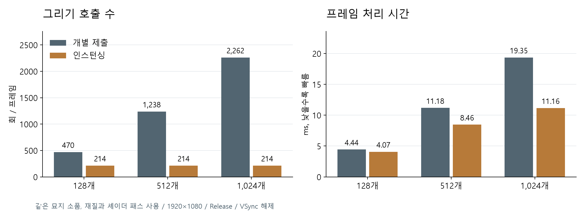
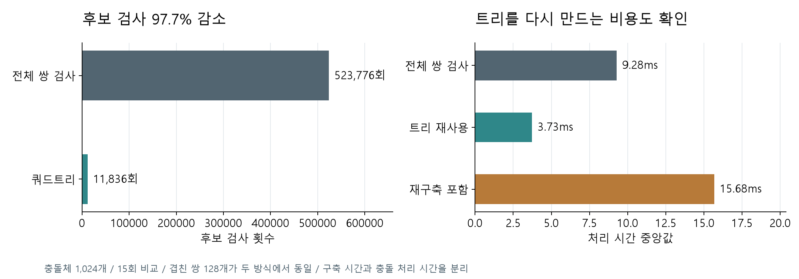

# 렌더링, 길찾기와 쿼드트리 측정

실제 게임의 엔진 코드를 사용하는 진단 빌드에서 측정했다. 영상 녹화는 끈 상태다. 테스트 장비는 Ryzen 7 6800HS, RTX 3050 Ti Laptop, 메모리 16GB이며, 해상도는 1920×1080이다. x64 Release와 VSync 해제 조건을 사용했다.

## 렌더링 부하

묘지 소품 `Cemetery_OBJ_Tomb_03`을 128개, 512개, 1,024개 추가했다. 소품 하나는 인덱스 5,403개, 메시 1개이며, 원래 모델의 불투명 재질과 셰이더 패스 1을 사용했다. 위치, 크기, 회전, 재질과 패스는 두 방식에서 같다.

개별 그리기에서는 소품마다 다른 인스턴스 그룹 키를 주고, 인스턴싱에서는 모델과 셰이더를 공유하는 기존 경로를 사용했다. 비교 중 캐릭터와 몬스터의 갱신을 멈췄고, 추가 소품에는 AI나 충돌체를 넣지 않았다.

각 구간은 8초이며 처음 2초를 제외했다. 128개 조건은 순서를 바꿔 반복했다. 프레임 시간은 실제 시계로 측정해 게임 로직의 delta 상한과 구분했다. 두 방식이 제출한 인덱스 수가 같은지도 확인했다.

표의 값은 개별 그리기 / 인스턴싱 순서다. 호출 수는 맵과 UI를 포함한 게임 `Pass`의 Draw 명령 수이며, DirectWrite 내부 명령은 포함하지 않는다.

| 추가 소품 | 그리기 호출 수 | 평균 FPS | 평균 프레임 시간 |
| --- | --- | --- | --- |
| 128개 | 470 / 214 | 225.36 / 245.60 | 4.44 / 4.07ms |
| 512개 | 1,238 / 214 | 89.47 / 118.17 | 11.18 / 8.46ms |
| 1,024개 | 2,262 / 214 | 51.67 / 89.63 | 19.35 / 11.16ms |



1,024개 조건에서 호출 수는 2,262회에서 214회로 줄었고, 평균 FPS는 51.67에서 89.63으로 바뀌었다. 소품 수가 늘어날수록 인스턴싱을 사용해도 프레임 시간은 길어졌다. 이 결과는 동일한 불투명 소품을 반복해서 그리는 조건의 비교이며, 캐릭터 AI나 스키닝 부하를 측정한 것은 아니다.

## A* 길찾기

게임에서 읽은 내비게이션 삼각형 709개를 사용했다. 가까운 목적지와 맵 반대편 목적지를 포함한 6개 경로를 각각 5회 준비 실행한 뒤 100회씩 검색했다. 시간에는 삼각형 탐색, A*, 월드 경로 변환과 경로 정리가 포함된다.

| 경로 | 탐색한 삼각형 | 경로 지점 | 시간 중앙값 | 시간 95백분위 |
| --- | --- | --- | --- | --- |
| 1 | 17 | 3 | 0.030ms | 0.059ms |
| 2 | 9 | 3 | 0.034ms | 0.034ms |
| 3 | 114 | 4 | 0.089ms | 0.157ms |
| 4 | 120 | 4 | 0.096ms | 0.189ms |
| 5 | 70 | 4 | 0.110ms | 0.221ms |
| 6 | 527 | 7 | 0.961ms | 1.314ms |

6개 경로를 0.25 월드 단위 간격으로 나눠 내비게이션 영역 안에 있는지 확인했다. 시연에서는 별도로 고른 우회 경로를 우클릭 입력으로 따라갔고, 목표와의 최종 거리는 약 0.064 월드 단위였다. 이 값은 영상 실행의 도착 확인값이며 검색 시간 통계와는 별개다.

## 쿼드트리

같은 면적에 구 모양 충돌체 128개, 512개, 1,024개를 배치했다. 일부는 의도적으로 겹치게 만들었다. 같은 충돌체에 대해 전체 쌍 검사와 실제 `QuadTree` 충돌 루틴을 실행하고, 충돌한 ID 쌍의 집합을 비교했다.

각 조건은 2회 준비 실행 후 15회 측정했다. 전체 쌍 검사는 `i < j` 조합의 교차 판정이다. 쿼드트리 측정에는 기존 중복 제거와 충돌 상태 관리도 포함된다. 트리 구축은 생성, 삽입과 통계 갱신까지 따로 측정했다.

| 충돌체 | 전체 / 트리 후보 검사 | 겹친 쌍 | 전체 쌍 검사 | 트리 충돌 처리 | 트리 구축 |
| --- | --- | --- | --- | --- | --- |
| 128 | 8,128 / 1,016 | 16 | 0.13ms | 0.25ms | 1.08ms |
| 512 | 130,816 / 5,888 | 62 | 2.31ms | 1.62ms | 5.28ms |
| 1,024 | 523,776 / 11,836 | 128 | 9.28ms | 3.73ms | 11.98ms |



1,024개 조건에서 후보 검사는 523,776회에서 11,836회로 97.7% 줄었다. 겹친 쌍 128개는 두 방식에서 같았다.

트리를 재사용할 때 충돌 처리는 3.73ms였지만, 매번 다시 만들면 구축에 약 11.98ms가 더 들었다. 전체 쌍 검사 9.28ms보다 총비용이 커지는 조건이다. 따라서 후보 수 감소만으로 프레임이 빨라진다고 판단하지 않았다. 게임의 `SceneObjectManager`가 카메라와 객체의 위치, 활성 상태, 개수 변화를 감지해 트리를 재사용하는 이유와 함께 봐야 한다.

## 재현과 원본 기록

[요약 JSON](../benchmarks/engine-diagnostics/2026-09-07/summary.json), [렌더링 프레임](../benchmarks/engine-diagnostics/2026-09-07/diagnostics-render.csv), [길찾기](../benchmarks/engine-diagnostics/2026-09-07/diagnostics-paths.csv), [쿼드트리](../benchmarks/engine-diagnostics/2026-09-07/diagnostics-quadtree.csv)를 남겼다. 실행 파일과 입력 CSV의 해시는 요약 JSON에 들어 있다.

```powershell
./scripts/build_game_probe.ps1 -Scenario diagnostics -Character Nicky `
  -Configuration Release -Resolution 1920x1080 `
  -SdkRoot 'C:/local-package/sdk-release' -AssetRoot 'C:/local-package/assets' `
  -BuildRoot "$PWD/out/diagnostics-new" -Run
python scripts/analyze_game_diagnostics.py `
  --build-root out/diagnostics-new --output out/diagnostics-new/summary.json
```

녹화한 실행은 성능 통계로 받지 않는다. [결과 분석 코드](../../scripts/analyze_game_diagnostics.py)는 녹화 여부, 화면 출력 성공, 비교한 인덱스 수, 충돌 결과 일치 여부와 표본 수를 검사한다.
